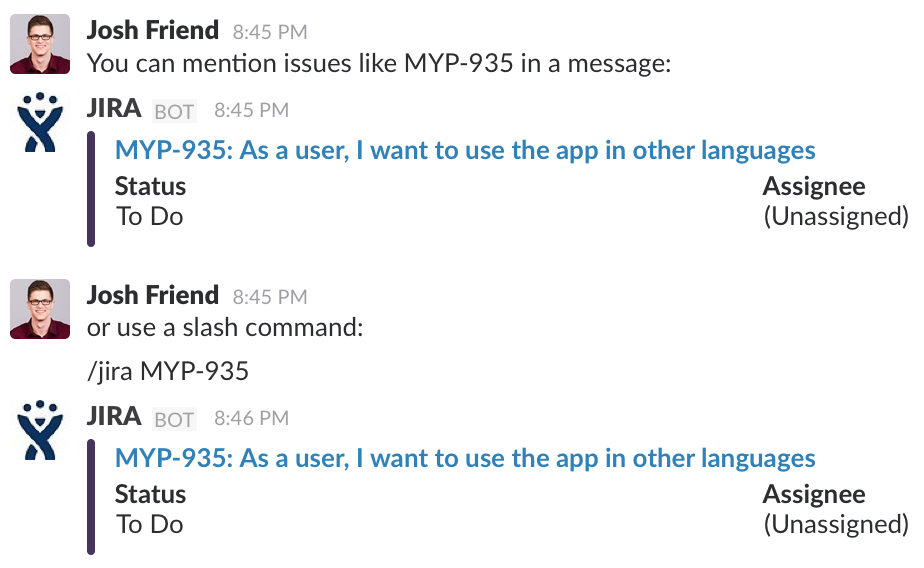

# Atlas
Webhook bot to integrate Atlassian products such as JIRA with Slack.

Current capabilities:



## Setup
### Deploy to Heroku
[![Deploy][hk-deploy-icon]][hk-deploy]

Click the button above to deploy the Atlas app to Heroku.

* `JIRA_URL`: The base URL of your JIRA instance. (e.g.
  `https://jira.example.com`)
* `JIRA_USERNAME`: Username to use when logging in to JIRA
* `JIRA_PASSWORD`: Password for your JIRA user

You may remove the `OPBEAT_*` keys if you don't want to use the
[Opbeat][opbeat] monitoring service for your app.

The app will be deployed to `https://<your-appname>.herokuapp.com`.

### Managing Webhook Security Tokens
Use the `manage.py` script to manage your webhook security tokens.

To run commands on Heroku, use `heroku run`:

```
herokou run python manage.py token list
Running python manage.py token list on <appname>.... up, run.1448
...
```

#### Add a Token
```
$ python manage.py token add XXXXXXXXXXXXXXXXXX -c random -d "Description of the token"
```

#### Remove a Token
```
$ python manage.py token remove XXXXXXXXXXXXXXXXXX
Token removed!
```

#### List All Tokens
```
$ python manage.py token list
Registered tokens:
`XXXXXXXXXXXXXXXXXX` in channel #random: Description of the token
```

### Channel Listening
Atlas can listen to messages sent on channels for JIRA IDs. You have two
options with this capability:

* Listen to all messages on a **single channel** for ticket IDs (word(s)
  matching the regular expression `[A-Z]+-\d+`). This requires a **separate
  webhook** for each channel.
* Listen for a trigger word on **all channels** and scan the message with the
trigger for ticket IDs. This option only requires a **single webhook**.

Both options can be used together if you don't want to take the time to set up
webhooks for each channel.

* [Go here][out-hook] and create a new outgoing webhook.
* Set the URL of the new command to
  `https://<your-appname>.herokuapp.com/api/v1/webhooks/jira`
* The request method should be set to POST
* Add the token to Atlas. (see ["Managing Webhook Security Tokens"]
  (#managing-webhook-security-tokens))

### Slash Command
**This is required to use Atlas with direct messages**. This is because you are
not permitted to have webhooks that listen on private messages.

* [Go here][slash-cmd] and create a new slash command called `/jira`.
* Set the URL of the new command to
  `https://<your-appname>.herokuapp.com/api/v1/webhooks/slash`
* The request method should be set to POST
* Add the token to Atlas. (see ["Managing Webhook Security Tokens"](#managing-webhook-security-tokens))

### Additional Configuraiton

* `JIRA_ID_BLACKOUT_PERIOD`: Set the time, in seconds for which the bot should
  ignore issues that have already been mentioned in the channel. The default is
  `300` (5 minutes).

## SSL
Atlas requires SSL to be used for all requests. This is to keep your messages
secure as outgoing webhooks that listen on specific channels receive all
messages sent on a channel. Also note that [SSL is **required** for slash
commands][slash-ssl].

The `*.herokuapp.com` domain that your app is assigned by Herou already
supports SSL. If you want to use a custom domain, you must supply your own SSL
certificate and pay for the [Heroku SSL addon][hk-ssl-addon].

[opbeat]: https://opbeat.com
[slash-cmd]: https://my.slack.com/services/new/slash-commands
[out-hook]: https://my.slack.com/services/new/outgoing-webhook/
[slash-ssl]: https://api.slack.com/slash-commands#ssl
[hk-deploy-icon]: https://www.herokucdn.com/deploy/button.svg
[hk-deploy]: https://heroku.com/deploy?template=https://github.com/joshfriend/atlas
[hk-ssl-addon]: https://elements.heroku.com/addons/ssl
